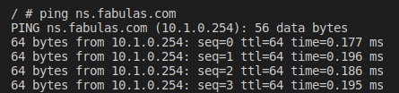
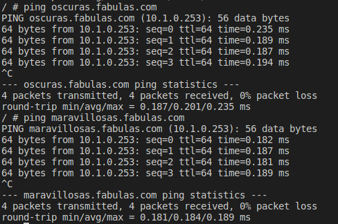
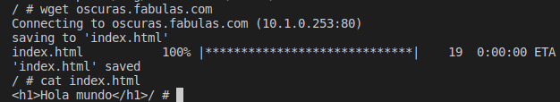

# Proyecto Apache
###### Nerea Pascual García

## Estructura
Para comenzar creamos una carpeta en la que contendremos todo el proyecto.
Crearemos un fichero llamado **docker-compose.yml**.

## Creación de ficheros  de prueba
Crearemos la carpeta llamada **html**.
Dentro de la carpeta html crearemos un fichero llamado **index.html** y otro llamado **info.php**.

En index.html escribiremos lo siguiente:
~~~
<h1>Hola mundo</h1>
~~~

En info.php lo siguiente:
~~~
<?php
    phpinfo();
    echo "Hola";
?>
~~~

## Docker-compose
El fichero docker-compose.yml lo modificaremos de la siguiente forma:
~~~
version: '3.9'
services:
asir_apache:
image: 'php:7.4-apache'
container_name: asir_apache
ports:
- '80:80'
    volumes:
    - ./html:/var/www/html
~~~

Utilizaremos el comando:
> docker-compose up

Con esto, crearemos nuestro contenedor asir_apache y cargaremos la imagen indicada.

## Prueba de funcionamiento
Para comprobar que el index.html y el info.php funcionan correctamente nos iremos a nuestro navegador y utilizaremos las siguientes rutas.
Para comprobar el index.html usaremos *localhost*. Nos devolverá lo siguiente:


Para comprobar el info.php usaremos *localhost/info.php*. Nos devolverá lo siguiente:


## Volumen Apache2
Modificamos el docker-compose.yml y añadimos lo siguiente:
~~~
volumes:
  confApache:
~~~
Quedará de la siguiente forma:
~~~
version: '3.9'
services:
asir_apache:
image: 'php:7.4-apache'
container_name: asir_apache
ports:
- '80:80'
volumes:
- ./html:/var/www/html
- confApache:/etc/apache2
volumes:
confApache:
~~~

A continuación copiaremos todos los ficheros del volumen apache2 en nuestra carpeta ConfApache con el comando:
> docker cp asir_apache:/etc/apache2 

## Sitios
Dentro de la carpeta html creamos la carpeta **Site1** y **Site2**. 
Movemos el archivo index.html a la carpeta Site1.
Creamos dentro de la carpeta Site2 un archivo llamado index.php en el que contendremos lo siguiente:
~~~
<?php
echo "Hola desde el sitio2";
?>
~~~

Cambiamos el docker-compose y el segundo volumen (ConfApache) lo modificaremos de la forma: 
```
./ConfApache 
```
para que coja nuestra carpeta ConfApache.

También añadiremos en los puertos:
```
'8000:8000'
```

Quedará de la siguiente forma:
~~~
version: '3.9'
services:
  asir_apache:
    image: 'php:7.4-apache'
    container_name: asir_apache
    ports:
    - '80:80'
    - '8000:8000'
    volumes:
    - ./html:/var/www/html
    - ./confApache:/etc/apache2
volumes:
    confApache:
~~~

Creamos la carpeta **confApache** y posteriormente entramos en sites-available y modificaremos el fichero llamado 000-default.conf. 
Cambiaremos la linea:
```
DocumentRoot /var/www/html/Site1
```
Creamos una copia de este fichero en la misma ubicación y lo renombraremos a 002-default.conf.

Cambiamos las siguientes lineas en el fichero:
```
VirtualHost *:8000
```
```
DocumentRoot /var/www/html/Site2
```
Con el contenedor arrancado hacemos click derecho sobre este y seleccionamos Attach Visual Studio Code. 
En la nueva ventana abrimos una terminal e introducimos lo siguiente:

> cd /var/www/html/
> a2ensite 002-default

Esto hará que se cree en sites-enable el fichero correspondiente a 002-default.

En el fichero ports.conf añadiremos la linea:
```
Listen 8000
```
Esto hará que se pueda escuchar en el puerto del sitio 2.

Borramos en el docker compose las siguientes lineas:
```
volumes:
    confApache:
```
Quedará de la siguiente forma:
~~~
version: '3.9'
services:
  asir_apache:
    image: 'php:7.4-apache'
    container_name: asir_apache
    ports:
    - '80:80'
    - '8000:8000'
    volumes:
    - ./html:/var/www/html
    - ./confApache:/etc/apache2
~~~

Paramos y arrancamos de nuevo el contenedor para que se apliquen todos los cambiamos realizados.

## Prueba de funcionamiento de Sitios
Para comprobar que funciona nos iremos al navegador y escribiremos lo siguiente.

En caso del sitio1: 
> localhost

Nos mostrará lo siguiente:


En el caso del sitio2: 
> localhost:8000

Nos mostrará lo siguiente:


## DNS
Creamos una carpeta llamada **confDNS**. En ella crearemos 2 subcarpetas a las que nombraremos **config** y **zonas**.

Dentro de la carpeta config crearemos 3 ficheros.
El primero llamado *named.conf* donde incluiremos lo siguiente:

~~~
include "/etc/bind/named.conf.options";
include "/etc/bind/named.conf.local";
~~~

El segundo llamado *named.conf.local* donde incluiremos lo siguiente:

~~~
zone "fabulas.com." {
        type master;
        file "/var/lib/bind/db.fabulas.com";
        allow-query {
            any;
        };
};
~~~

Por último, el tercero llamado *named.conf.options* donde incluiremos lo siguiente:
~~~
options {
    directory "/var/cache/bind";
    forwarders {
        8.8.8.8;
        8.8.4.4;
    };
    forward only;
    listen-on { any; };
    listen-on-v6 { any; };
    allow-query {
        any;
    };
};
~~~

En la carpeta zonas creamos un fichero llamado *db.fabulas.com* donde incluiremos lo siguiente:

~~~
$TTL    3600
@       IN      SOA     ns.fabulas.com. nerea.fabulas.org. (
                   2007010401           ; Serial
                         3600           ; Refresh [1h]
                          600           ; Retry   [10m]
                        86400           ; Expire  [1d]
                          600 )         ; Negative Cache TTL [1h]
;
@       IN      NS      ns.fabulas.com.
@       IN      MX      10 servidorcorreo.fabulas.org.

ns     IN      A       10.1.0.254
~~~


Con esto hecho, nos iremos a nuestro docker-compose.yml e incluiremos lo siguiente a la altura de asir_apache:

~~~
bind9:
    container_name: asir_bind9
    image: internetsystemsconsortium/bind9:9.16
    ports:
      - 5300:53/udp
      - 5300:53/tcp
    networks:
      bind9_subnet:
        ipv4_address: 10.1.0.254
    volumes:
      - /home/asir2a/Escritorio/SRI/proyectoApache/confDNS/config:/etc/bind
      - /home/asir2a/Escritorio/SRI/proyectoApache/confDNS/zonas:/var/lib/bind
  asir_cliente:
    container_name: asir_cliente
    image: alpine
    networks:
      - bind9_subnet
    stdin_open: true
    tty: true
    dns:
      - 10.1.0.254
networks:
  bind9_subnet:
    external: true
~~~

Con esto, hacemos un docker-compose up y todos los contenedores (asir_bin9, asir_cliente(alpine) y asir_apache) se levantarán.

### Comprobación de funcionamiento de DNS
Haremos click derecho sobre el contenedor Alpine y seleccionamos Attach shell.

A continuación, haremos ping.
> ping ns.fabulas.com

Si todo funciona correctamente, tendremos la comprobación de que el DNS está bien configurado.

Comprobación:



### Resolución de dominios
Nos vamos al docker-compose.yml y establecemos la ip de asir_apache:

~~~
networks:
  bind9_subnet:
    ipv4_address: 10.1.0.253
~~~

Modificamos el db.fabulas.com de la siguiente forma:

~~~
$TTL    3600
@       IN      SOA     ns.fabulas.com. nerea.fabulas.org. (
                   2007010401           ; Serial
                         3600           ; Refresh [1h]
                          600           ; Retry   [10m]
                        86400           ; Expire  [1d]
                          600 )         ; Negative Cache TTL [1h]
;
@       IN      NS      ns.fabulas.com.
@       IN      MX      10 servidorcorreo.fabulas.org.

ns     IN      A       10.1.0.254
oscuras    IN      A       10.1.0.253
maravillosas     IN      CNAME   oscuras
~~~

Volvemos a la shell de alpine y volvemos a probar a hacer ping pero esta vez a oscuras y maravillosas:



Nos vamos a la carpeta de confApache y entramos en sites-available.
Modificaremos los ficheros 000-default.conf y 002-default.conf.

En 000-default.conf añadiremos la linea:
```
ServerName oscuras.fabulas.com
```

En 002-default.conf añadiremos la linea:
```
ServerName maravillosas.fabulas.com
```
Además, también cambiaremos el puerto del 8000 al 80.


Nos iremos al contenedor de Alpine, abrimos una shell y comprobaremos que funciona la configuración anterior.

Comprobación:




## DirectoryIndex

Para utilizar la directiva DirectoryIndex creamos en la carpeta de Site1 un nuevo fichero al que llamaremos patata.html.

Este contendrá:

~~~
<h1>Patata</h1>
~~~

Al igual que hemos hecho en la carpeta Site1, lo hacemos en Site2, esta vez con un fichero llamado patata.php que contendrá:

~~~
<?php
echo "Patata desde el sitio2";
?>
~~~

Nos vamos a la carpeta sites-available y modificamos los ficheros 000-default.conf y 002-default.conf.

En el archivo 000-default.conf añadimos la etiqueta:
~~~
<Directory "/var/www/html/Site1">
  DirectoryIndex patata.html
</Directory>
~~~

En el archivo 002-default.conf lo siguiente:
~~~
<Directory "/var/www/html/Site2">
  DirectoryIndex patata.php
</Directory>
~~~

De esta forma, al acceder a los sitios nos encontraremos con el contenido de los ficheros introducidos (patata.html e patata.php) respectivamente.

Para ello, abrimos una terminal del contenedor asir_cliente y escribimos el comando:

> wget oscuras.fabulas.com

Posteriormente, para leer el fichero patata.html que el DirectoryIndex nos ha establecido como fichero principal a mostrar desde el sitio1 usamos el comando:

> cat index.html

Haremos lo mismo en el caso del sitio2.

Comprobación:


## SSL

Primeramente debemos instalar ssl.
Para ello usaremos los comandos:

> apt-get update

> apt-get install apache2 openssl


Posteriormente, abriremos una terminal asociada a asir_apache e introducimos el comando:

> a2enmod ssl

Crearemos una carpeta llamada certificados en confApache.
Abrimos una terminal asociada a apache y usamos los siguientes comandos:

> cd /etc/apache2/certificados

> openssl req -new -newkey rsa:4096 -x509 -sha256 -days 365 -nodes -out apache-certificate.crt -keyout apache.key

Se crearán dos ficheros (apache-certificate.crt y apache.key) dentro de la carpeta certificados.

Dentro de la carpeta html creamos la carpeta **SitioSSL**.
En esta creamos un index.html que contenga:
~~~
<h1>hola desde el sitio ssl</h1>
~~~

En el docker-compose añadimos el puerto: - '443:443'


Nos dirigimos a sites-available y entramos al fichero default-ssl.conf y lo modificaremos con lo siguiente:
~~~
<IfModule mod_ssl.c>
<VirtualHost *:443>
	ServerAdmin webmaster@localhost

	DocumentRoot /var/www/html/SitioSSL

	ErrorLog ${APACHE_LOG_DIR}/error.log
	CustomLog ${APACHE_LOG_DIR}/access.log combined

	SSLEngine on

	SSLCertificateFile	/etc/apache2/certificados/apache-certificate.crt
	SSLCertificateKeyFile /etc/apache2/certificados/apache.key


	<FilesMatch "\.(cgi|shtml|phtml|php)$">
			SSLOptions +StdEnvVars
	</FilesMatch>
	<Directory /usr/lib/cgi-bin>
			SSLOptions +StdEnvVars
	</Directory>
</VirtualHost>
</IfModule>
~~~

Entramos en una shell de apache y escribimos:

> a2ensite default-ssl

Con esto, el fichero default-ssl.conf de sites-available se replicará a sites-enable.

Reiniciaremos el contenedor de apache.

Abrimos una terminal asociada al cliente y escribimos:

Desde FireFox buscamos: https://10.1.0.253/

Nos debería mostrar el contenido del index.html que creamos en la ruta de html/SitiosSSL.

